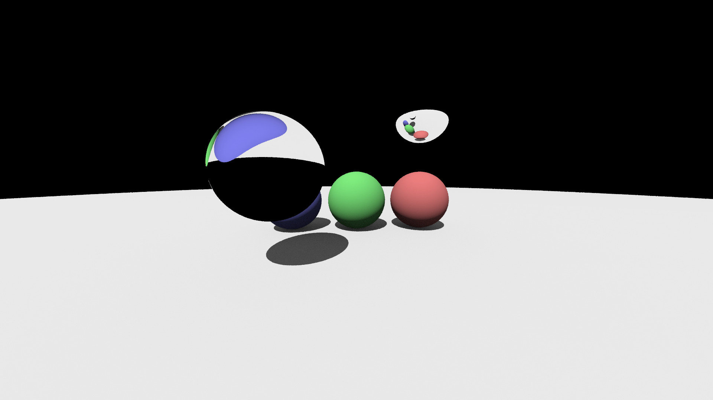

# classical-raytracer-lecture-2020



[p-ray](https://p-ray.oskt.us/)の2020年度講義 "古典的レイトレーサーの実装" の講義用リポジトリです.

演習用のディレクトリやリファレンス実装が含まれています。CMakeを用いて簡単にビルドが行なえます。

講義スライド: https://speakerdeck.com/yumcyawiz/osk-number-p-ray2020nian-du-jiang-yi-gu-dian-de-reitoresafalseshi-zhuang

## Requirements

* C++17
* CMake 3.12 or Higher
* OpenMP (並列化を利用する場合)

## ディレクトリ構造

```
.
├── CMakeLists.txt
├── LICENSE
├── README.md
├── ref           リファレンス実装
└── src           演習で実装していく部分
```

## ビルド方法

ビルド用のディレクトリ`build` を作成した後、CMakeを利用してビルドを行います。

Windowsでビルドする場合は`cmake`実行後にVisual Studioのソリューションファイルが生成されるので、それを開いてビルドします。

```
mkdir build
cd build
cmake -DCMAKE_BUILD_TYPE=Release ..
make
```

デバッグモードでビルドしたい場合は`-DCMAKE_BUILD_TYPE=Release`を`-DCMAKE_BUILD_TYPE=Release`に変更してください。

また、リファレンスもビルドしたい場合は、以下のようにCMakeオプション`BUILD_REFERENCE`を`On`にしてください。
```
cmake -DBUILD_REFERENCE=On ..
```

## 実装方法

リポジトリをforkし, `src/`にヘッダオンリーに実装していきます。ビルドは上記方法で行えます。